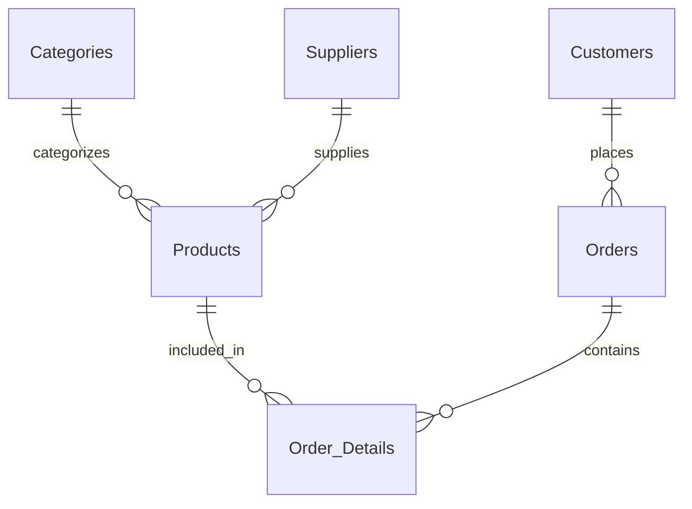

# Database Schema Analysis Report

This report analyzes the database schema implemented in [final-script.sql](/final-script.txt), which satisfies Third Normal Form (3NF) requirements.

## 3NF Compliance Analysis

The database schema demonstrates 3NF compliance through:

1. **Primary Key Dependencies**: All non-key attributes depend on the primary key
2. **No Transitive Dependencies**: No attributes depend on other non-key attributes
3. **Proper Foreign Key Relationships**: All relationships are enforced through constraints
4. **Comprehensive Constraints**: Appropriate NOT NULL, CHECK, and UNIQUE constraints

## Schema Structure

The implemented schema consists of seven properly normalized tables:
- Customers: Stores customer personal information
- Categories: Contains product categorization data
- Suppliers: Manages supplier information
- Products: Tracks inventory with appropriate relationships
- Orders: Records order headers with customer references
- Order_Details: Implements the many-to-many relationship between orders and products
- System_Users: Manages system access and permissions



## SQL Features Implemented

### User Management

**CREATE USER / GRANT / ALTER USER**
```sql
CREATE USER c##lci_database_manager IDENTIFIED BY 1234;
GRANT connect, resource TO c##lci_database_manager;
ALTER USER c##lci_database_manager QUOTA 200M ON users;
```

### Table Creation and Constraints

**CREATE TABLE with PRIMARY KEY, FOREIGN KEY, NOT NULL, UNIQUE, CHECK constraints**
```sql
CREATE TABLE Products (
    product_id NUMBER(8) CONSTRAINT products_product_id_pk PRIMARY KEY,
    product_name VARCHAR2(100) CONSTRAINT products_product_name_nn NOT NULL,
    category_id NUMBER(2) CONSTRAINT products_category_id_nn NOT NULL,
    supplier_id NUMBER(5),
    price NUMBER(10,2) CONSTRAINT products_price_ck CHECK(price > 0),
    stock_quantity NUMBER(6) DEFAULT 0 CONSTRAINT products_stock_quantity_ck CHECK(stock_quantity >= 0),
    created_at DATE DEFAULT SYSDATE,
    CONSTRAINT products_category_id_fk FOREIGN KEY (category_id) REFERENCES Categories(category_id),
    CONSTRAINT products_supplier_id_fk FOREIGN KEY (supplier_id) REFERENCES Suppliers(supplier_id)
);
```

### Sequence Management

**CREATE SEQUENCE / NEXTVAL / CURRVAL**
```sql
CREATE SEQUENCE customers_seq START WITH 1 INCREMENT BY 1;
INSERT INTO Customers VALUES (customers_seq.NEXTVAL, 'John', 'Smith', ...);
INSERT INTO Orders VALUES (orders_seq.NEXTVAL, 1, TO_DATE('2023-01-15', 'YYYY-MM-DD'), ...);
INSERT INTO Order_Details VALUES (orders_seq.CURRVAL, 1, 1, 699.99);
```

### View Creation

**CREATE OR REPLACE VIEW with READ ONLY and CHECK OPTION**
```sql
CREATE OR REPLACE VIEW v_customers AS
SELECT first_name, last_name, email, phone, address, created_at 
FROM Customers WITH READ ONLY;

CREATE OR REPLACE VIEW elite_customers AS
SELECT first_name, last_name, email, phone, address, created_at FROM Customers
WHERE created_at < ADD_MONTHS(SYSDATE, -6 * 12) WITH CHECK OPTION;
```

### String Functions

**String Concatenation, UPPER**
```sql
CREATE OR REPLACE VIEW v_customers_full_name AS
SELECT customer_id, UPPER(first_name || ' ' || last_name) AS full_name, email, phone, address, created_at
FROM Customers;
```

### Mathematical Functions

**CEIL, FLOOR**
```sql
CREATE OR REPLACE VIEW v_product_prices AS
SELECT product_id, product_name, CEIL(price) AS rounded_price, FLOOR(stock_quantity) AS stock_quantity
FROM Products;
```

### Date Functions

**ADD_MONTHS, SYSDATE**
```sql
CREATE OR REPLACE VIEW elite_customers AS
SELECT first_name, last_name, email, phone, address, created_at FROM Customers
WHERE created_at < ADD_MONTHS(SYSDATE, -6 * 12) WITH CHECK OPTION;
```

### Joins

**Multi-table JOIN**
```sql
CREATE OR REPLACE VIEW v_order_details AS
SELECT o.order_id, c.first_name || ' ' || c.last_name AS customer_name, p.product_name, od.quantity, od.unit_price
FROM Orders o
JOIN Customers c ON o.customer_id = c.customer_id
JOIN Order_Details od ON o.order_id = od.order_id
JOIN Products p ON od.product_id = p.product_id
ORDER BY o.order_id, od.product_id;
```

### Transaction Management

**COMMIT**
```sql
COMMIT;
```

### Data Manipulation

**INSERT**
```sql
INSERT INTO Categories VALUES (categories_seq.NEXTVAL, 'Electronics', 'Electronic devices and accessories');
```

### Data Type Conversion & Formatting

**TO_DATE**
```sql
INSERT INTO Orders VALUES (orders_seq.NEXTVAL, 1, TO_DATE('2023-01-15', 'YYYY-MM-DD'), 'Delivered', 849.98);
```

# Conclusion
This report shows some of the competencies we've acquired in our database course, including the ability to create a well-structured database schema that adheres to 3NF principles. The implementation of various SQL features demonstrates our understanding of database management and design.

We could've added more features but we decided to keep it simple as we've spent a lot of time on the database manager system for a unique presentation. We hope you enjoyed it and learned something new. Thank you for your attention!

## Signing off,

**Abdulrahman Mousa**

**Sofia Saldumbide Rissotto**

**Akshay Kheterpal**

**Shayan Delbari**