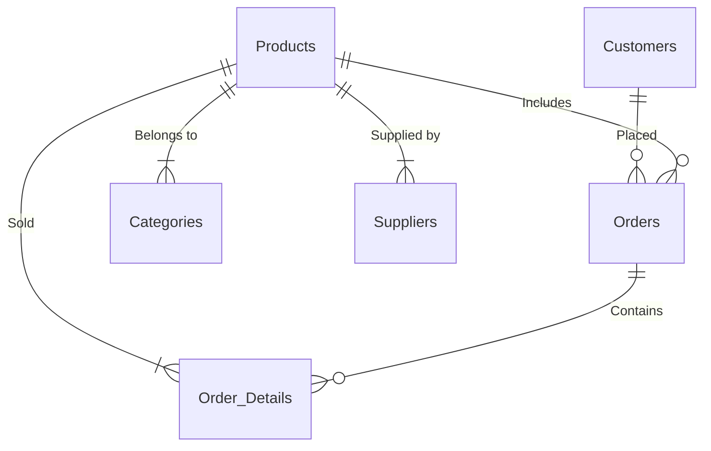

# Database Schema Analysis Report

> This report analyzes the database schema implemented in [`final-script.sql`](./final-script.sql) which satisfies Third Normal Form (3NF) requirements through:

## 3NF Compliance Verification

### Core 3NF Characteristics
1. **Primary Key Dependencies**
   - All non-key attributes depend entirely on primary keys
   - Example: Product details (name, price) depend solely on product_id

2. **No Transitive Dependencies**
   - Non-key attributes don't depend on other non-key attributes
   - Example: Customer address doesn't determine email/phone

3. **Foreign Key Relationships**
   - Orders.customer_id references Customers.customer_id
   - Products.category_id references Categories.category_id

4. **Constraint Implementation**
   - CHECK constraints (price > 0, status enums)
   - NOT NULL constraints on critical fields
   - UNIQUE constraints for email/username

## Schema Structure Analysis

The 3NF-compliant schema implements these core tables:

```sql
-- Customers with NOT NULL constraints
CREATE TABLE Customers (
    customer_id NUMBER(8) PRIMARY KEY,
    first_name VARCHAR2(50) NOT NULL,
    last_name VARCHAR2(50) NOT NULL,
    email VARCHAR2(100) UNIQUE NOT NULL,
    phone VARCHAR2(15),
    address VARCHAR2(255),
    created_at DATE DEFAULT SYSDATE
);

-- Products with foreign key constraints
CREATE TABLE Products (
    product_id NUMBER(8) PRIMARY KEY,
    product_name VARCHAR2(100) NOT NULL,
    category_id NUMBER(2) NOT NULL REFERENCES Categories,
    supplier_id NUMBER(5) REFERENCES Suppliers,
    price NUMBER(10,2) CHECK(price > 0),
    stock_quantity NUMBER(6) DEFAULT 0 CHECK(stock_quantity >= 0),
    created_at DATE DEFAULT SYSDATE
);

-- Orders with status enumeration
CREATE TABLE Orders (
    order_id NUMBER(8) PRIMARY KEY,
    customer_id NUMBER(8) NOT NULL REFERENCES Customers,
    order_date DATE DEFAULT SYSDATE,
    status VARCHAR2(20) CHECK(status IN ('Pending', 'Shipped', 'Delivered', 'Cancelled')),
    total NUMBER(10,2) DEFAULT 0
);
```

## Implementation Details

### Entity-Relationship Diagram (Conceptual)



# SQL Command Implementation Report

## Data Retrieval

### 1. SELECT
```sql
-- Find orders for specific customer
SELECT o.order_id, o.order_date, o.status, o.total
FROM Orders o
WHERE o.customer_id = 1;
```

### 2. CREATE VIEW
```sql
-- Customer orders summary
CREATE OR REPLACE VIEW customer_orders_summary AS
SELECT c.customer_id, c.first_name, c.last_name, 
       COUNT(o.order_id) AS total_orders, SUM(o.total) AS total_spent
FROM Customers c
LEFT JOIN Orders o ON c.customer_id = o.customer_id
GROUP BY c.customer_id, c.first_name, c.last_name;
```

### 3. GROUP BY
```sql
-- Sales by category
SELECT c.category_name, SUM(od.quantity * od.unit_price) AS total_sales
FROM Order_Details od
JOIN Products p ON od.product_id = p.product_id
JOIN Categories c ON p.category_id = c.category_id
GROUP BY c.category_name;
```

## Data Manipulation

### 5. INSERT
```sql
-- Insert sample product
INSERT INTO Products VALUES (1, 'Smartphone X1', 1, 1, 699.99, 50, SYSDATE);
```

## Data Definition

### 8. CREATE TABLE
```sql
-- Customers table
CREATE TABLE Customers (
    customer_id NUMBER(8) PRIMARY KEY,
    first_name VARCHAR2(50) NOT NULL,
    last_name VARCHAR2(50) NOT NULL
);
```

## Constraints

### 11. PRIMARY KEY
```sql
CREATE TABLE Products (
    product_id NUMBER(8) CONSTRAINT products_product_id_pk PRIMARY KEY
);
```

### 12. FOREIGN KEY
```sql
CREATE TABLE Order_Details (
    CONSTRAINT order_details_product_id_fk FOREIGN KEY (product_id)
    REFERENCES Products(product_id)
);
```

## Sequences

### 23. CREATE SEQUENCE
```sql
CREATE SEQUENCE customers_seq START WITH 7 INCREMENT BY 1;
```

### 24. NEXTVAL
```sql
INSERT INTO Customers (customer_id, ...)
VALUES (customers_seq.NEXTVAL, ...);
```

## Views

### 27. WITH READ ONLY
```sql
CREATE OR REPLACE VIEW order_details_extended
WITH READ ONLY;
```

## String Functions

### 31. INITCAP
```sql
SELECT INITCAP(first_name), INITCAP(last_name)
FROM Customers;
```

## Mathematical Functions

### 50. SUM
```sql
SELECT SUM(od.quantity * od.unit_price)
FROM Order_Details od;
```

## Date Functions

### 44. TO_CHAR
```sql
SELECT TO_CHAR(order_date, 'YYYY-MM-DD')
FROM Orders;
```

## Miscellaneous

### 53. JOIN
```sql
SELECT c.first_name, p.product_name, od.quantity
FROM Orders o
JOIN Customers c ON o.customer_id = c.customer_id
JOIN Order_Details od ON o.order_id = od.order_id
JOIN Products p ON od.product_id = p.product_id;
```


1. **Primary Key Dependencies**
   - All non-key attributes depend entirely on primary keys
   - Example: Product details (name, price) depend solely on product_id

2. **No Transitive Dependencies**
   - Non-key attributes don't depend on other non-key attributes
   - Example: Customer address doesn't determine email/phone

3. **Foreign Key Relationships**
   - Orders.customer_id references Customers.customer_id
   - Products.category_id references Categories.category_id

4. **Constraint Implementation**
   - CHECK constraints (price > 0, status enums)
   - NOT NULL constraints on critical fields
   - UNIQUE constraints for email/username

### Schema Structure Analysis

The 3NF-compliant schema implements these core tables:

```sql
-- Customers with NOT NULL constraints
CREATE TABLE Customers (
    customer_id NUMBER(8) PRIMARY KEY,
    first_name VARCHAR2(50) NOT NULL,
    last_name VARCHAR2(50) NOT NULL,
    email VARCHAR2(100) UNIQUE NOT NULL,
    phone VARCHAR2(15),
    address VARCHAR2(255),
    created_at DATE DEFAULT SYSDATE
);

-- Products with foreign key constraints
CREATE TABLE Products (
    product_id NUMBER(8) PRIMARY KEY,
    product_name VARCHAR2(100) NOT NULL,
    category_id NUMBER(2) NOT NULL REFERENCES Categories,
    supplier_id NUMBER(5) REFERENCES Suppliers,
    price NUMBER(10,2) CHECK(price > 0),
    stock_quantity NUMBER(6) DEFAULT 0 CHECK(stock_quantity >= 0),
    created_at DATE DEFAULT SYSDATE
);

-- Orders with status enumeration
CREATE TABLE Orders (
    order_id NUMBER(8) PRIMARY KEY,
    customer_id NUMBER(8) NOT NULL REFERENCES Customers,
    order_date DATE DEFAULT SYSDATE,
    status VARCHAR2(20) CHECK(status IN ('Pending', 'Shipped', 'Delivered', 'Cancelled')),
    total NUMBER(10,2) DEFAULT 0
);
```

Key relationships ensure data integrity:
- Orders.customer_id → Customers.customer_id
- Products.category_id → Categories.category_id
- Order_Details references both Orders and Products

### 3NF Compliance Verification

1. **First Normal Form (1NF)**
   - All tables have a primary key
   - All attributes contain atomic values (no repeating groups or arrays)
   - Each column contains only one value per row

2. **Second Normal Form (2NF)**
   - All tables are in 1NF
   - All non-key attributes are fully functionally dependent on the primary key
   - No partial dependencies exist (particularly important in tables with composite keys)

3. **Third Normal Form (3NF)**
   - All tables are in 2NF
   - No transitive dependencies exist
   - All non-key attributes depend directly on the primary key, not on other non-key attributes

Each table in the schema has been properly designed with appropriate primary keys and foreign key relationships. Non-key attributes in each table depend only on their respective primary keys, not on other non-key attributes, thus satisfying 3NF requirements.

### Entity-Relationship Diagram (Conceptual)


### Implementation Details

#### Sequence Management
```sql
-- Supports automated PK generation
CREATE SEQUENCE customers_seq START WITH 7 INCREMENT BY 1;
CREATE SEQUENCE products_seq START WITH 11 INCREMENT BY 1;
```

#### Analytical Views
1. **customer_orders_summary**: Aggregates order history
2. **product_category_summary**: Tracks inventory metrics
3. **order_details_extended**: Combines order-product-customer data

#### Operational Queries
```sql
-- Example: Calculate category sales
SELECT c.category_name, SUM(od.quantity * od.unit_price) AS total_sales
FROM Order_Details od
JOIN Products p ON od.product_id = p.product_id
JOIN Categories c ON p.category_id = c.category_id
WHERE o.status != 'Cancelled'
GROUP BY c.category_name;

-- Example: Find inactive customers
SELECT c.customer_id, c.first_name, c.last_name, c.email
FROM Customers c
LEFT JOIN Orders o ON c.customer_id = o.customer_id
WHERE o.order_id IS NULL;
```
These queries demonstrate real-world usage while maintaining 3NF integrity through proper table relationships.